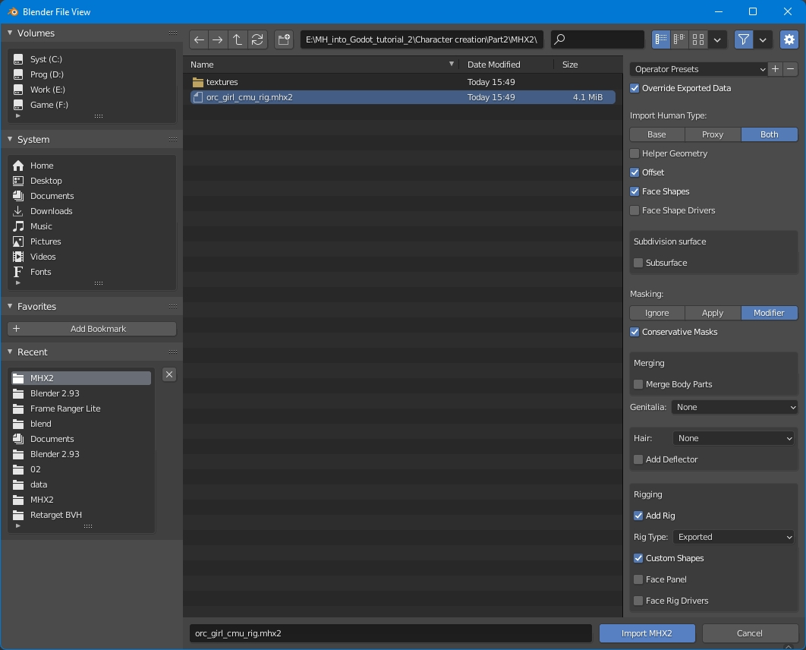
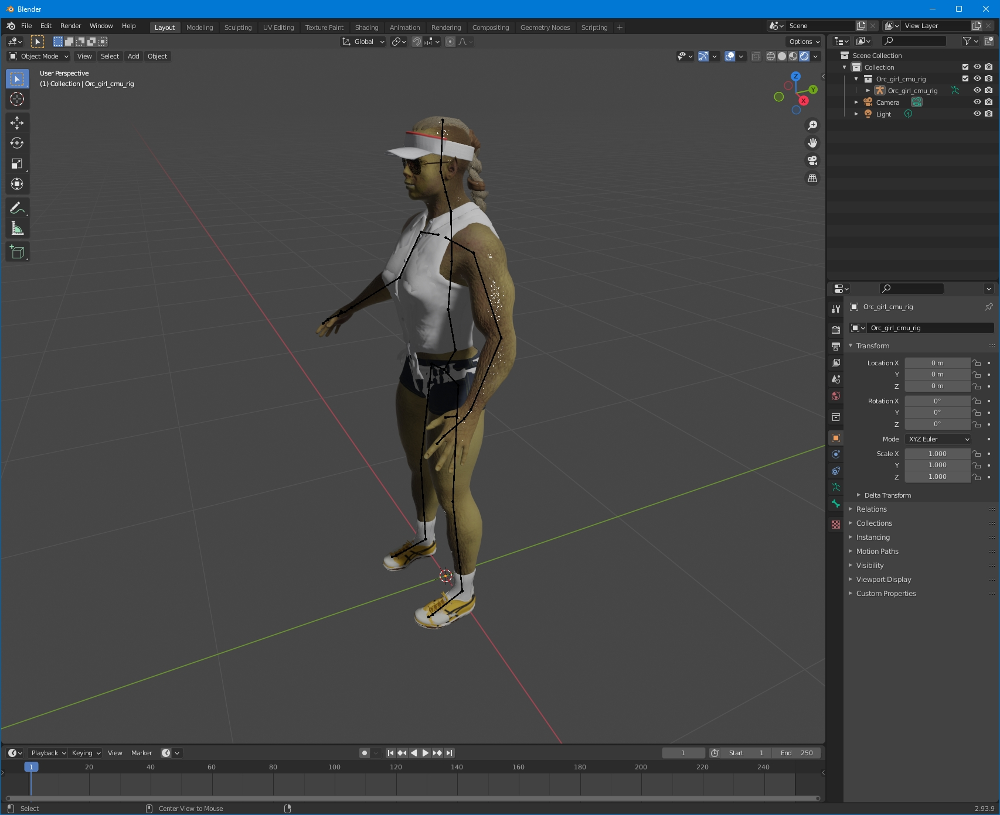
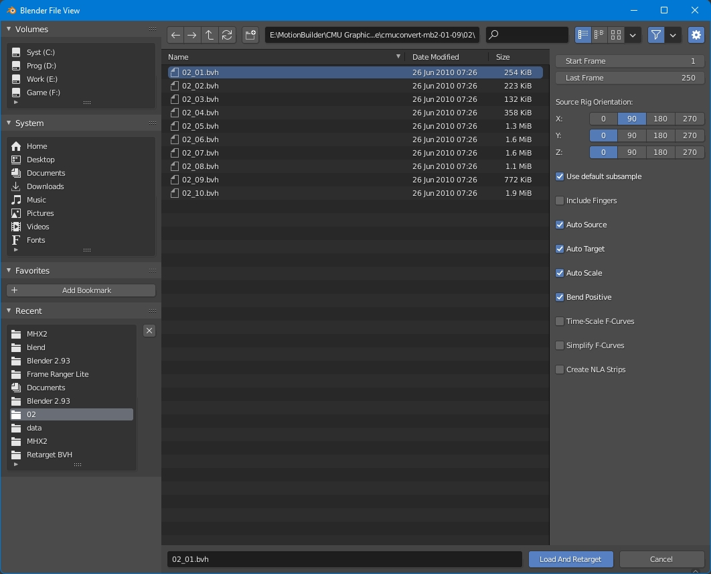
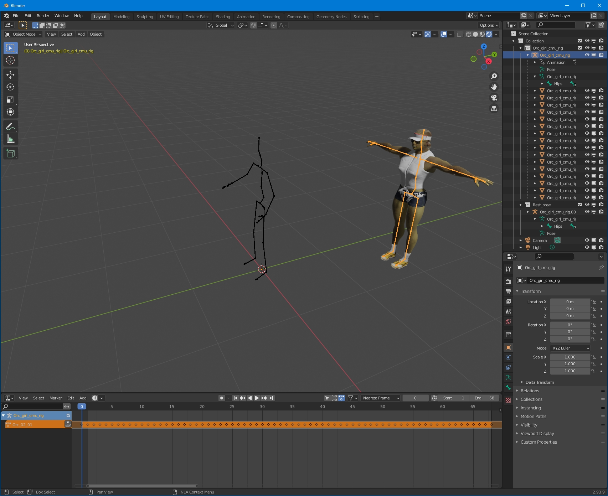
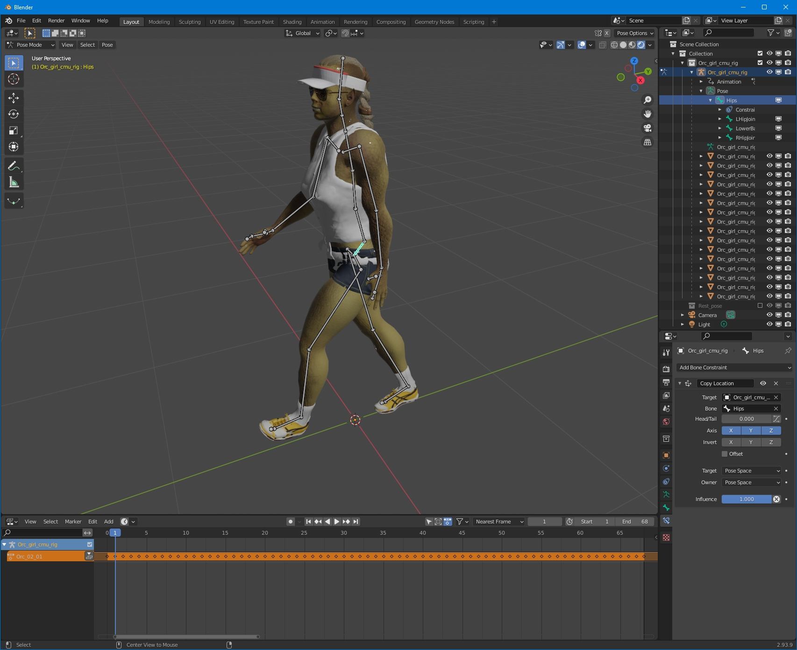
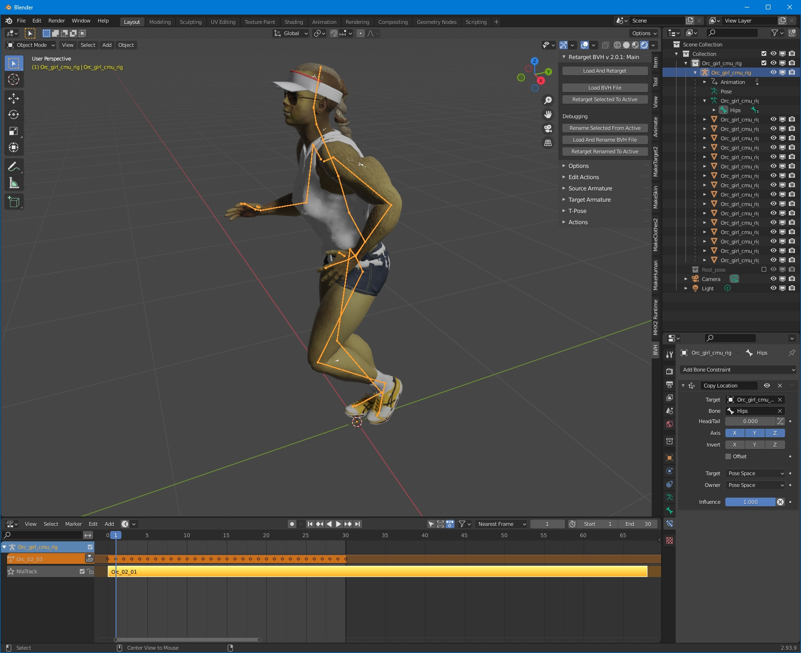
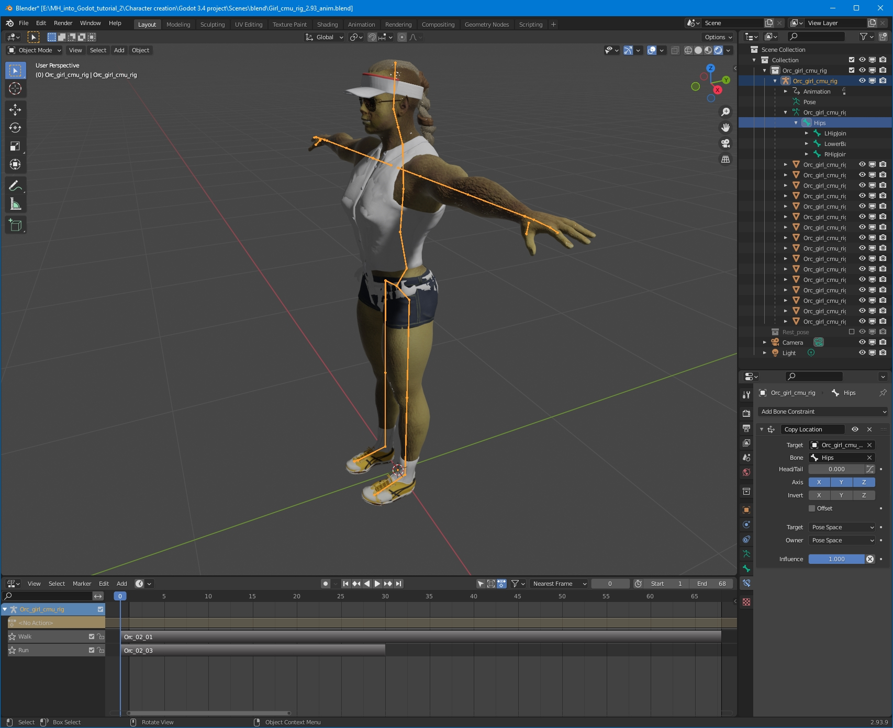
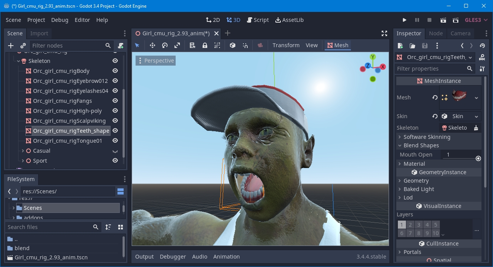

## Importing into Blender and assigning animations. Importing into Godot

Need two addons for Blender:

* [_Retarget BVH_](https://github.com/black-punkduck/retarget-bvh)
* [_MHX2_](https://github.com/makehumancommunity/mhx2-makehuman-exchange)

### Import

The import panel can be called in 2 ways:

1. File –> Import –> MakeHuman (.mhx2)
2. N-панель –> Import MHX2

result is identical:

#### If you need facial animation, you can:
1. to enable the "Face Shapes" option for emotions _via shape keys_;
2. if you choose _a rig with face bones_, then the emotions can be realised _by poses_.

In _Rigging_ turn **on** _Add Rig_ and choose _Rig Type_ [Exported].

The rig assigned to the MH will be imported.

[Import MHX2]

Remove all the masks:

If the clothes will be the only one, it's better to leave masks.

### Assignment of animation

***A little note.** _For the game, the animation must be played without moving the character. Moving the character is done in the game engine by moving the object itself. As the animation in the example contains movement, you need to get rid of it (or take the animation already prepared). You can choose any convenient way for the character to stay in place. In my opinion, the easiest is to tie the Hips(root) bone to the position at rest. The way is not the best, but simple and fast. To do this, I make a copy of the skeleton at rest position. This is only necessary for binding._

To assign the animation use _Retarget BVH_ plugin finalized by **punkduck** [MakeHuman Team] (for which he is very thankful).

[Load And Retarget] allows you to load animation and immediately apply to the character.

Select animation (02_01.bvh) and load it.

_*Now bind the Hips animation bone to the rest pose bone for the character to walk in place._

Add the running animation (02_03.bvh).

Now the file is ready to be exported to Godot.

The documentation for the engine recommends that you [triangulate the models](https://docs.godotengine.org/en/stable/tutorials/assets_pipeline/importing_scenes.html#exporting-considerations).

But Blender does not allow you to triangulate an object that contains shape keys:

`Modifier cannot be applied to a mesh with shape keys`

### Godot. Import

The _Blender Importer Addon for Godot_ allows you to open Blender files as Godot scenes.

This feature is built into Godot 4, but it [doesn't work correctly there](https://godotforums.org/d/27915-godot-3-4-4-released/22).

Just save the .blend file in your project folder and it will be automatically imported into the engine.

In an open scene, you can remove the resting pose skeleton you don't need anymore and separate clothes by scene for easy switching:

[**Video**](https://mega.nz/file/utM2xDpB#blLOPw8nJxrBOGkJLF7jAAiI81bUE59lyG0IWEXi80U)

Face morphs will be transferred, but you must remember to set the same Shapes settings for different body parts.

_**The main part of the tutorial is finished.**_

Translated with http://www.DeepL.com/Translator (free version)
