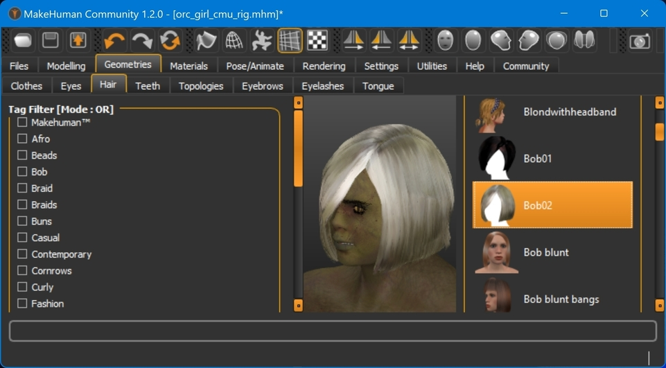
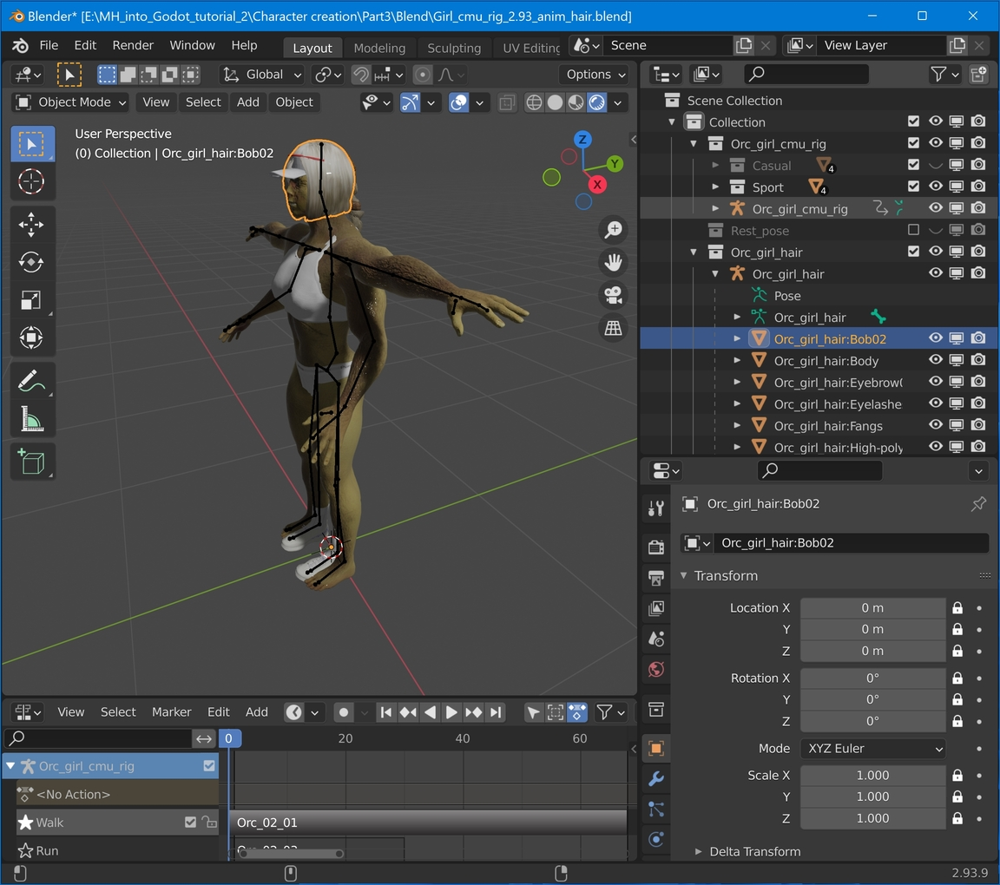
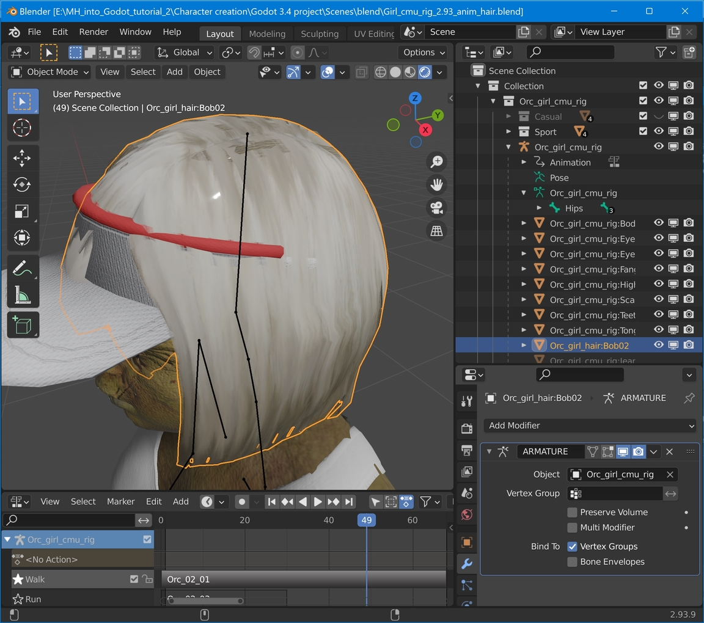
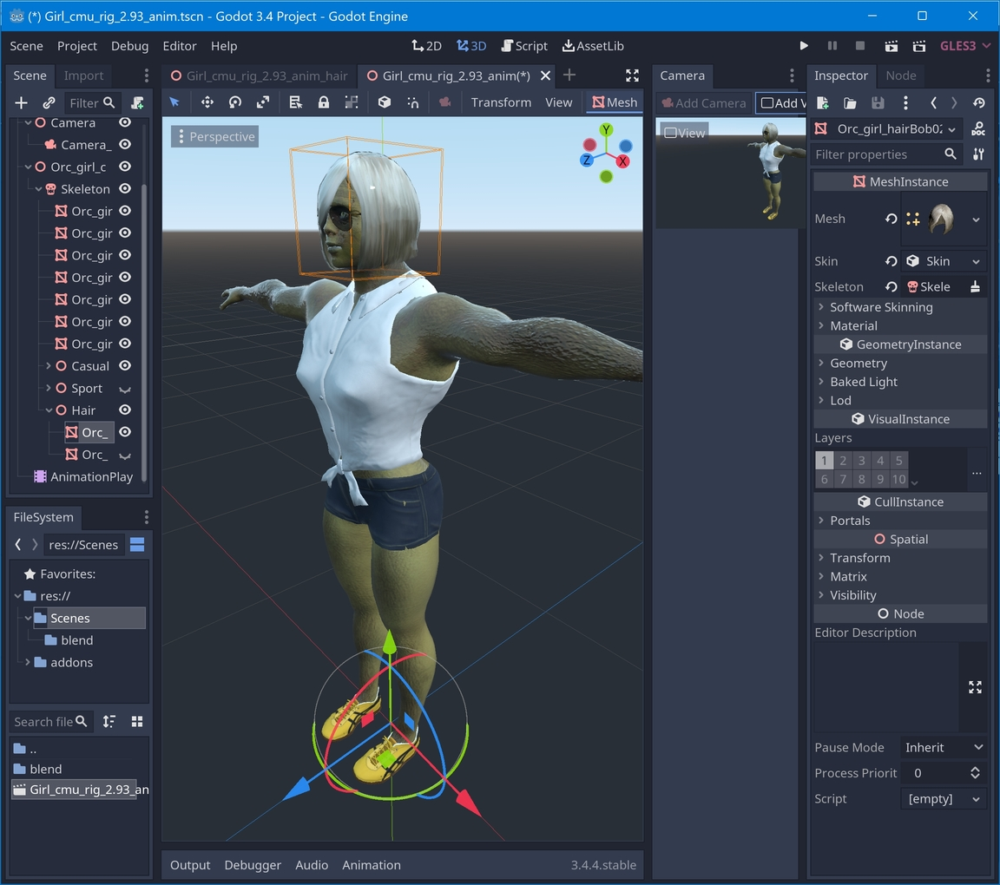
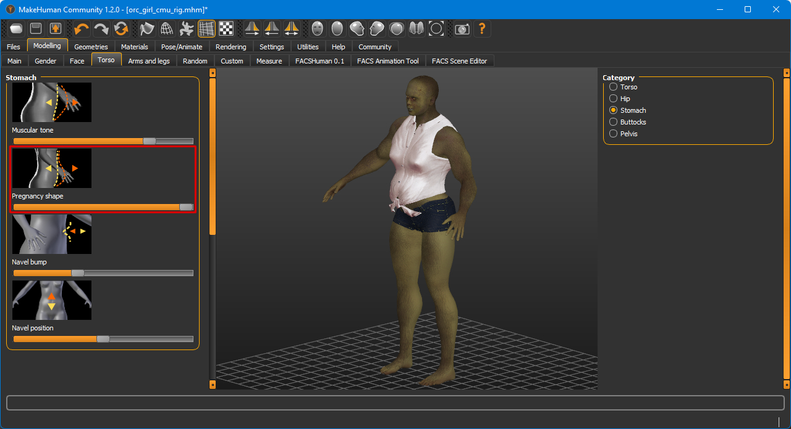
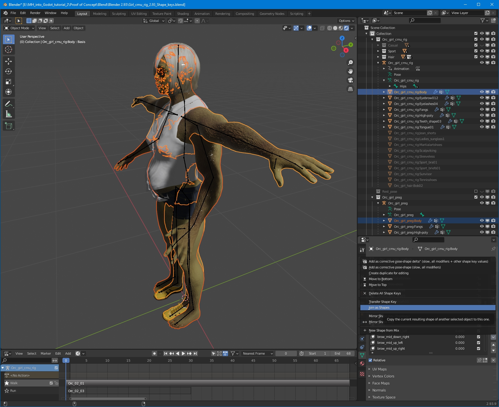
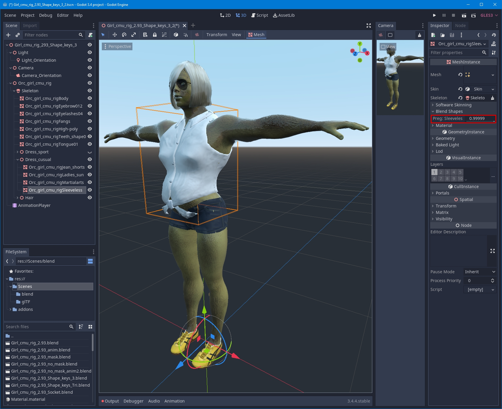

## Change of hair and Body Shapes

1. **Change of hair (eyebrows, eyelashes, teeth).**
2. **Body Shapes (Shape Keys).**

**_It is assumed that there are already:_**

1. _the original MakeHuman model, which needs to be modified;_
2. _a Blender file derived from this model._

## Part 1. Change of hair (eyebrows, eyelashes, teeth)

Changing body parts is somewhat different from choosing clothes. Since you can't have a character with several hairstyles (unlike clothes), you have to work with each hairstyle individually.

Load the model for which you want to change the hairstyle. Choose the hairstyle you want:

**bob02** (In the standard installation)\
author\
_Joel Palmius_\
_Jonas Hauquier_

If you want, you can add eyebrows, eyelashes, teeth to transfer. It is better to remove unnecessary things.

The model is exported in .mhx2 format ("Scale units" in meters).

### Blender

Opens the previously saved file with the original model.

1. The file with the new hairstyle is imported into it.
 \
 \
 

2. The hairstyle is transferred to the collection to the original model and linked (with a Shift).
3. The armature from the original model is assigned.
4. The entire new collection should be deleted.
5. The file is saved to the Godot project folder.
 \
 \
 

### Godot

The Blender file imported into Godot can be saved as a new scene. If the previous file was already saved as a scene, the hair can be transferred to it as a node.

## Body Shapes (Shape Keys)

**Assignment of shape keys**

### MakeHuman

Load the model into which you want to add the shape key. The model should have clothes, to which a key will be applied to the form. Apply the modifier:

The operation must be repeated for each key.

The model is exported in .mhx2 format (units in meters).

### Blender

Opens the previously saved file with the original model.

_**Triangulation**_

_The engine documentation recommends triangulating the models._

_But Blender does not allow you to triangulate an object that contains shape keys._
[code]Modifier cannot be applied to a mesh with shape keys[/code]
_If the model does not contain shape keys, then that model can be triangulated before they are assigned._

**Choice of modifiers for shape keys**

You may only assign modifiers that do not change the size of the model skeleton! If the modifier changes the dimensionality of the skeleton (e.g. arm/leg length, shoulder width etc.), the result of the animation will be unpredictable.

1. The modified model is imported into the file with the original model.
2. The part (body) of the modified model is selected first.
3. Then the same part of the original model is selected (with CTRL).
4. Assign a shape key (Object Data Properties –> Shape Keys –> Join as shapes) 
 \
 \
 

8. The procedure is repeated with the clothing elements.
9. The entire new collection should be deleted.
10. The file is saved in the Godot project folder.

### Godot

The Blender file imported into Godot is saved as a new scene.

There is a bug: if _"Bland Shape"_ is set to 1, artifacts appear:

It is desirable to set the value to less than 1.0:

\
Translated with http://www.DeepL.com/Translator (free version)
