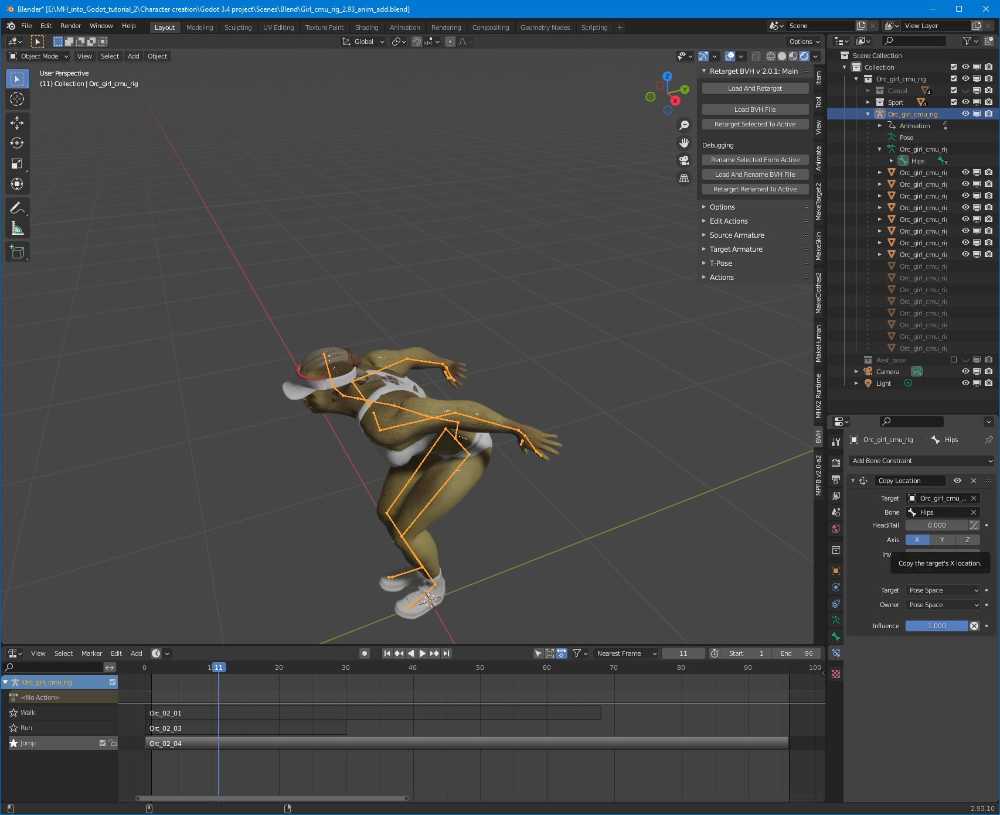
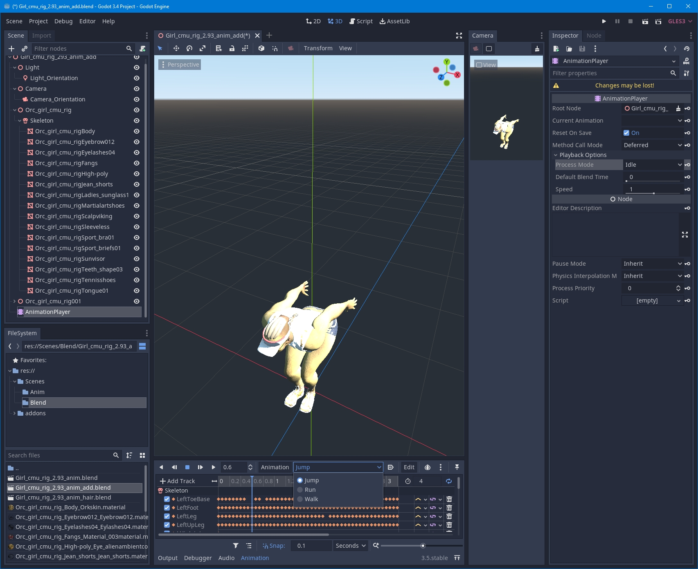
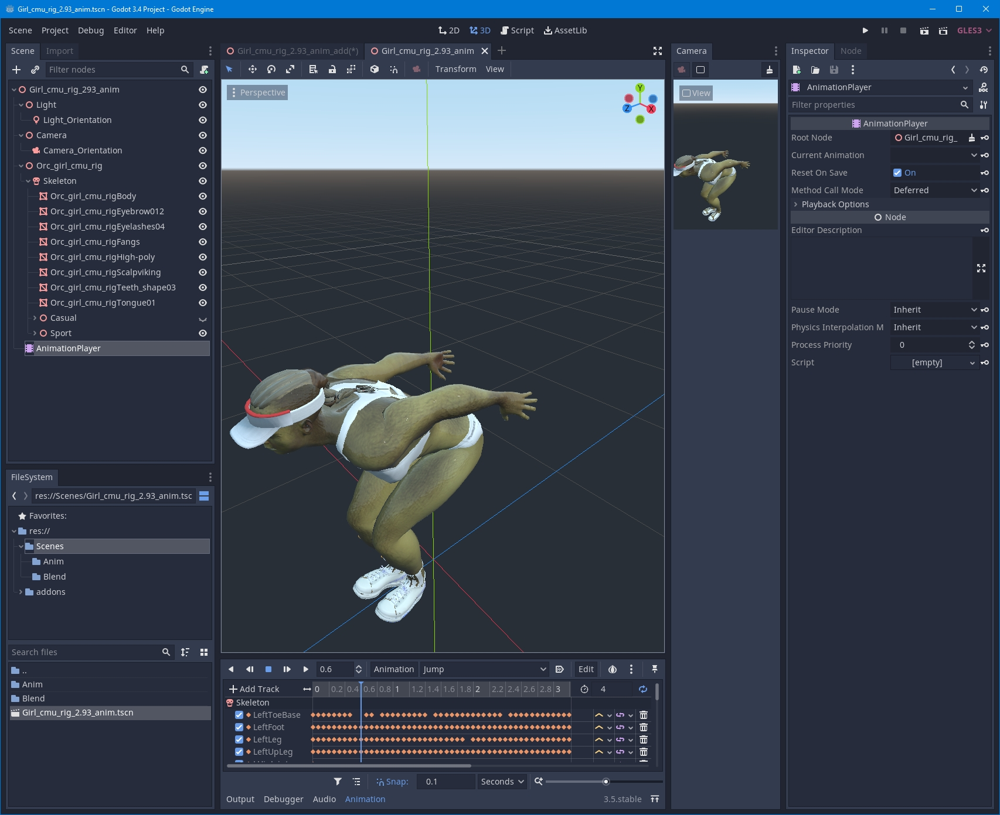

## Adding animation

It is assumed that there are already:

1. _Blender file with animation;_
2. _a scene in Godot derived from this file._

 

### Blender

Opens a previously saved file with the original model and animations.
1. A new animation is imported.
2. The file is saved in the Godot project folder.

_**Note.** In this example, the jump animation is applied in place. In general, it is desirable to move the model in the game engine, as a node, then it will be possible to change the height of the jump. But in this case, I will show a fixed jump. To do this, leave the constraint of the bone fixed on the X-axis only. This change will affect the existing animations, but they are already in the scene file in Godot._

### Godot

1. From the new file imported into Godot, only a new animation is needed:
 \
 \
 

2. It can be copied or saved for future use:
 \
 \
 

3. Open AnimationPlayer in an existing scene and load the new animation file there by copying or exporting:
 \
 \
 

That's it, the animation is added to the scene file.

\
**A huge grateful thanks to those who have helped and supported me:**
* **punkduck** (MH team)
* [**Raphael**](https://files.mastodon.social/media_attachments/files/106/976/022/172/293/623/original/0ceb03882540b2a7.jpeg)

\
Translated with http://www.DeepL.com/Translator (free version)
